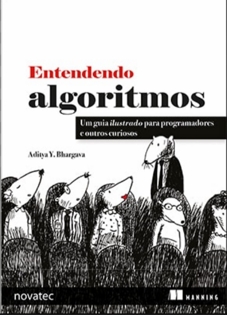

# Entendendo Algoritmos: Um guia ilustrado para programadores e outros curiosos

Do inglês "Grokking Algorithms: An Illustrated Guide for Programmers and Other Curious People" por Aditya Y. Bhargava, é um livro que elucida sobre algoritmos e estrutura de dados de forma rápida e superficial, mas com mantendo rigor teórico útil para auxiliar em disciplinas da universidade e entendimento de como alguns tópicos mais avançados em computação são fundamentados.

## Capítulos e minhas considerações

O livro é organizado em 11 capítulos ilustrados com alguns exercícios teóricos e práticos. Nesse atual repositório, estarão minhas resoluções desses exercícios, assim como nesse README colocarei sobre os tópicos que aprendi e me chamaram mais atenção durante os capítulos conforme eu for lendo.

### Capítulo 1 - Introdução a algoritmos

Buscas binárias em geral são muito interessantes de serem utilizadas, porém só funcionam se a estrutura de dados estiver ordenada. Além disso, tentei induzir qual era a equação geral do número de etapas que uma pesquisa binária teria a partir do número de elementos da estrutura.

 E = 2^p --> p = log(2)E 
 
 (Log de E na base 2, sendo E o número de elementos e P a quantidade de etapas).

Além disso, entendi que o desempenho de algoritmos não é necessariamente medido por tempo de execução, e sim sobre o número de etapas necessárias para a execução, com o Big O, que leva em conta a pior caso do algoritmo (Confesso que achava que era o caso médio)

Por fim, em um dos problemas apresentados pelo livro, o do caixeiro-viajante tive a curiosidade de saber se a solução otimizada do problema falha somente por causa da condição de ser o menor caminho possível.

### Capítulo 2 - Ordenação por seleção

O capítulo nos apresenta as estruturas de dados mais simples, que são arrays e listas encadeada, e como funciona a memória do computador.

Um array é um vetor, é estático, com tamanho fixo e informações sequenciais dentro da memória. Para questões de inserções e retiradas de dados dentro dessa estrutura, seu desempenho é visto como O(n) sendo n o número de operações, um tanto demorado, visto que é necessário alterar os endereços de todos os elementos, quando ocorre no meio da estrutura. O que isso significa? Apenas que o tempo de execução vai aumentando na medida que o número de elementos dentro do array aumenta. No entanto, a busca nesse tipo de estrutura é rápida, já que como a estrutura possui um tamanho fixo, é mais fácil mapear onde estão os elementos para um acesso aleatório quase instantâneo.

Uma lista encadeada é uma estrutura de dados onde todos os itens estão espalhados em lugares não sequenciais da memória e um espaço de memória só se interliga com outro por meio de ponteiros que apontam o espaço de memória seguinte do próximo item. A inserção e remoção nessa estrutura são rápidas, visto que não há a limitação de tamanho, porém a busca é extremamente lenta, já que não se sabe o endereço do elemento que se quer procurar, sendo necessário percorrer toda a lista em busca dos ponteiros até achar o elemento (acesso sequencial).

O capítulo me foi bem útil para entender sobre as listas encadeadas e saber quando aplicá-las, principalmente na disciplina de Estrutura de Dados I, na qual também estudei sobre as especificações de simplesmente encadeada e duplamente encadeada.

### Capítulo 3 - Recursão

Esse capítulo me ajudou a entender um assunto que até o 3º semestre da graduação ainda era algo bastante complexo para entender, que foi a recursividade.

A recursividade é a chamada da função nela mesma, possuindo um caso-base, que é o caso mais primitivo e simples do problema e é quando o algoritmo para, e um caso-recursivo, que é onde ainda é possível quebrar o problema novamente para aplicar a função recursiva. Na recursividade, até a função anterior fica esperando e é jogada para uma pilha de chamada até que as recursividades posteriores sejam feitas.

Pilhas são baseadas no conceito de last in first out (LIFO - último a entrar é o primeiro a sair), onde o último a entrar é chamado de topo. Nesse tipo de estrutura de dados, só é possível fazer as ações de inserção e remoção (e a leitura, claro).

### Capítulo 4 - Quicksort

O capítulo 4 complementa muito o capítulo 3, mostrando sobre a perspectiva da técnica de dividir para conquistar na hora de realizar alguma recursividade, pois a divisão é a dita procura pelo caso-base. 

Além disso, nos é mostrado um pouco sobre o algoritmo de ordenação quicksort, que é uma forma de dividir para conquistar de ordenação por meio de pivôs.

### Capítulo 5 - Tabelas Hash

Tabela hash é uma estrutura de dados de correlação entre um elemento (chave) e outro elemento (valor). A correlação é sempre feita por meio de uma função hash com array.

Funções só são consideradas hash se forem consistentes, ou seja, uma mesma entrada só pode gerar uma mesma saída todas as vezes, bem como diferentes chaves devem mapear diferentes valores, sendo que os retornos das funções sempre nos darão índices válidos dentro dos arrays. Essas duas condições me geraram a dúvida de se toda função hash é uma função injetiva. A resposta é não, somente as hashs perfeitas, que são funções que mapeiam um conjunto fixo de chaves para inteiros distintos (índices) sem gerar colisões.

Colisões são um problema dentro de tabelas hash quando precisamos alocar chaves parecidas e que disputam o mesmo espaço de memória, que se sobreescrevem uma a outra.

As tabelas hash podem ser tão velozes na procura de elementos quanto arrays, e tão velozes na inserção e remoção de itens. Uma boa função hash aloca os valores no array de modo simétrico.

O python possui uma estrutura de tabela hash, que é o dicionário. Tabelas hash são muito utilizadas para mapear algum iteme com relação a outro, para filtrar duplicatas de dados dentro da estrutura e para fazer caching.